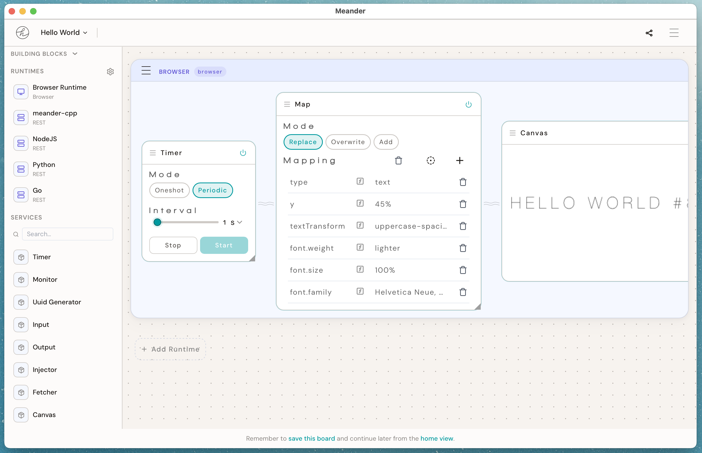

# Readymade Build Guide

Quick instructions for building the project from the repository root.

## Screenshot



## Platform build guides

Build steps differ per platform. Pick yours:

- [Web](./README-web.md) — runs in the browser from `hkp-frontend/`; Node + npm only, no
  native toolchain
- [MacOS](./README-macos.md) — desktop app (`build.sh`)
- [Linux](./README-linux.md) — desktop app (`build-linux.sh`), required packages, compiler
  and sandbox troubleshooting
- [Windows](./README-windows.md) — desktop app (`build-windows.ps1`), PowerShell notes
- [iOS](./README-ios.md) — device + simulator (`build-ios.sh`), bundled web app, signing
- [Android](./README-android.md) — `build-android.sh`, NDK/vcpkg setup, bundled web app

## Prerequisites (all platforms)

- Node.js + npm
- CMake 3.21+ — for the native shells; the [web target](./README-web.md) needs neither CMake
  nor a C++ toolchain

Note: vcpkg is vendored in `3rdparty/vcpkg` and is used by CMake during configure/build.

Each platform guide lists the additional toolchain it needs.

## Frontend dev server

For UI iteration on the native shells, run their frontend in dev mode from `meander/frontend`:

```bash
cd meander/frontend
npm install
npm start
```

This starts Vite on port `8555` with hot reload. To use the dev server instead of embedded
assets, build with embedding disabled — see the `EmbeddedFrontend`/dev-server notes in your
platform guide, or configure CMake directly:

```bash
cmake -S . -B build -DMEANDER_USE_EMBEDDED_FRONTEND=OFF
```

## Run tests

Run each project's test suite from the repository root:

```bash
./run-all-tests.sh
```

Or run suites individually:

### hkp-python

```bash
cd hkp-python
./run_tests.sh
```

Optional examples:

```bash
./run_tests.sh -v
./run_tests.sh -k map
```

### hkp-node

```bash
cd hkp-node
npm install
npm test
```

### hkp-rt

```bash
cd hkp-rt
./run-tests.sh
```

Optional examples:

```bash
./run-tests.sh Debug runtime
./run-tests.sh Debug services
```

### hkp-frontend

```bash
cd hkp-frontend
npm install
npm test
```

## Output

Build artifacts are generated under `build/` (`build-linux/` on Linux). See your platform
guide for the exact artifact path.

## License and copyright

- License: GNU AGPL v3.0 (see `LICENSE`)
- Copyright ownership: see `COPYRIGHT`

## Project documents

- [CONTRIBUTING](./CONTRIBUTING.md) — how to contribute, and the CLA
- [Code of Conduct](./CODE_OF_CONDUCT.md) — how we treat each other in the project's
  spaces, and what we hope Readymade gets used for
- [Security policy](./SECURITY.md) — reporting a vulnerability, safe harbour, self-hosting
  notes
- [Trademark](./TRADEMARK.md) — using the Readymade name and logo
